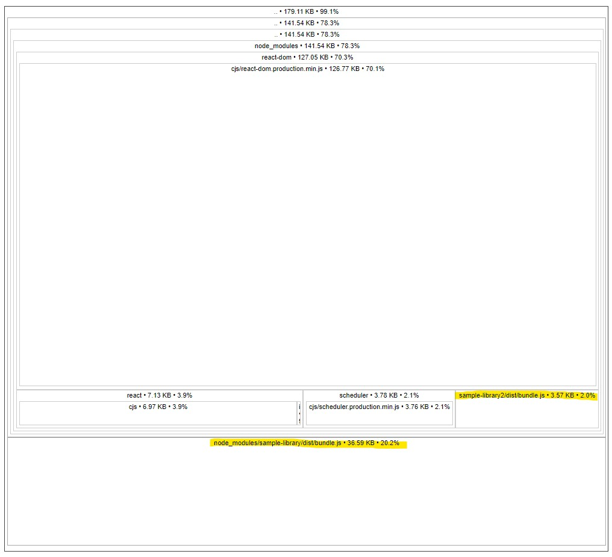

# Tree Shaking

Tree shaking is the act of removing dead code from your bundle. [MDN Docs](https://developer.mozilla.org/en-US/docs/Glossary/Tree_shaking)

As a webapp dev, the primary concern you should have is "are my libraries tree shaking properly?".

## Demo

In this demo, there is a sample library and a consuming app.

The sample library exports:

- A shorter string `short_string` (~3KB)
- A longer string `SUPER_LONG_STRING` (~30KB)

The app consumes `short_string` from this library twice, in different ways.

```jsx
import fullImport from "sample-library";
import { short_string } from "sample-library2";

const App = () => {
  return (
    <div>
      {short_string} - {fullImport.short_string}
    </div>
  );
};
```

The first import is not tree shakable because both `SUPER_LONG_STRING` and `short_string` are exported together in 1 object.  
You might find it more intuitive to read the library's code:

```js
// This will not be tree shakable
export default { short_string, SUPER_LONG_STRING };

// This is tree shakable
export { short_string, SUPER_LONG_STRING };
```

### Running the demo

You can run this demo locally, although the tree shaking effects can only be seen after it was been built.

```bash
yarn
yarn dev-ts
```

### Building the demo

```bash
yarn build-ts
npx source-map-explorer dist/assets/<index.filename>.js --no-border-checks
```

After building the demo, you can use the tool `source-map-explorer` to easily visualize how the library is included in the bundle.



The smaller box with yellow highlights shows how small the library is, if tree shaking works and `SUPER_LONG_STRING` is not included.  
In contrast, the large block of `33KB` is how large the library is if `SUPER_LONG_STRING` is not tree shaken.

## Looking out for poorly written libraries

Typically, modern and well established libraries will not have this problem.  
Mature tools such as webpack are able to derive when something can be excluded or not, even when the code is highly complex.  
Case in point: I tried to come up with simple examples to demonstrate when tree shaking doesn't work, but couldn't think of more than one.

Of course, there are more reasons why a library might not handle it properly, but anything more than this is out of scope of this sharing.

If you're really setting out to optimize your app, then tools like `source-map-explorer` can help you find problematic libraries.
